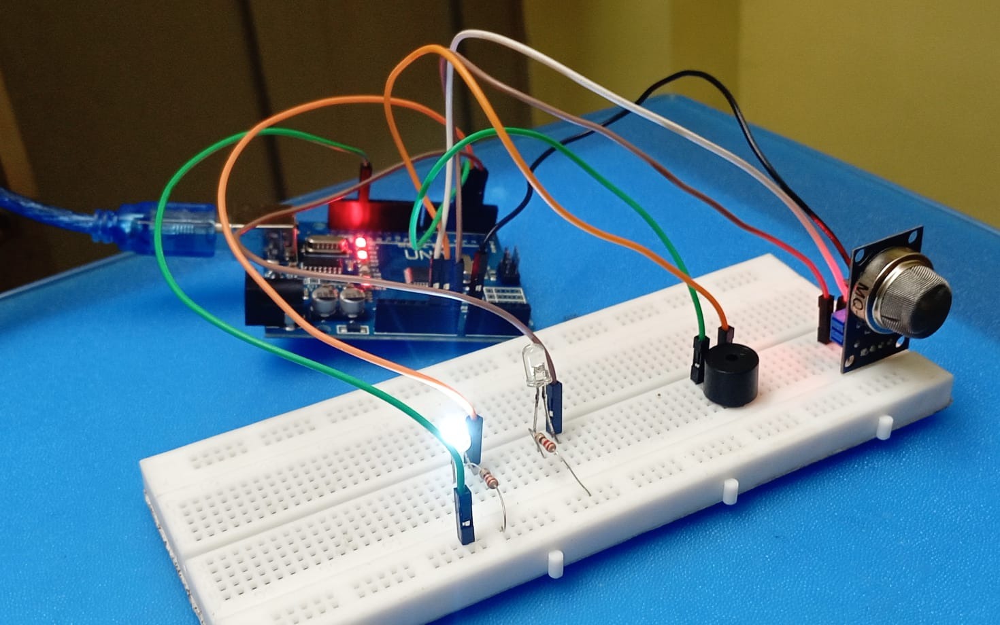

# Gas Leakage Detection System

## 📌 Overview
This project is a Gas Leakage Detection System built using Arduino Uno and MQ-2 Sensor. The system continuously monitors gas levels and alerts users through an LED, buzzer, and LCD display when gas concentration exceeds a predefined threshold.

## 🚀 Features
- Real-time gas detection
- LCD display monitoring
- LED warning indication
- Buzzer alert system
- Easy and low-cost implementation

## 🛠 Technologies Used
- Arduino Uno
- MQ-2 Gas Sensor
- LCD 16x2 (I2C)
- LED
- Buzzer
- Arduino IDE

## ⚙️ Working
1. MQ-2 sensor detects gas concentration.
2. Arduino reads sensor values.
3. Values are displayed on the LCD.
4. If the value exceeds the threshold:
   - LED turns ON
   - Buzzer sounds
   - LCD displays "GAS Detected!"

## 📂 Files
- GasLeakageDetector.ino – Arduino source code

## 🔮 Future Enhancements
- GSM SMS alerts
- Mobile app integration
- Wi-Fi monitoring
- Automatic gas valve control
## 📷 Project Image

## 👩‍💻 Author
Nelavai Usha
